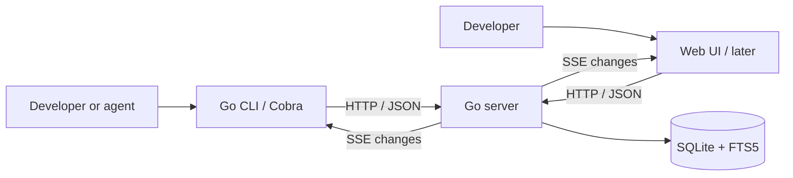

# Tiki: architecture and feature plan

Updated · 2026-09-24 · Architecture and implementation roadmap

Tiki is an internal item tracker for developers and agents. It should make capturing, finding, understanding, and updating work exceptionally quick. Bugs, features, and tasks share one item model, one API, and one set of rules.

**Confirmed direction:** Go, a CLI first, a shared team server, and an eventual minimalist web UI with dark mode, strong keyboard support, and live updates.

**Recommended starting architecture:** one Go server, SQLite on local storage, an HTTP/JSON API, a Cobra CLI, and SSE for notifications of committed changes. Add the web client after the CLI proves the workflows. The choices below are proposals; performance numbers are acceptance targets, not measured results.

## 1. Product principles and scope

Optimize three things together:

- **Execution:** quick startup, indexed queries, small responses, bounded memory, and predictable latency under concurrent use.
- **Interaction:** few commands or keystrokes, useful defaults, persistent navigation context, and no mandatory administrative ceremony.
- **Operation:** one service to run, straightforward backups, few dependencies, and failures that are easy to diagnose.

Initial planning envelope: one organization, with tags spanning repositories and teams, roughly 5–100 daily users, and up to 100,000 items. These are sizing assumptions to validate, not product limits. Start with one server instance and accept a brief maintenance window for upgrades; high availability would change the database decision.

The server owns the data. Every client uses its API, including a CLI running on the server machine. Local development runs the same server on loopback. Repository configuration can select a server and default tags; item data does not live in Git.

The first release should support this complete loop: create an item, find it, assign it, discuss it, move it through work, and inspect its history. Offline synchronization, collaborative text editing, custom workflow builders, sprint planning, time tracking, plugin systems, and AI-generated prioritization are outside that release.

## 2. Architecture and technology choices



| Concern | Starting choice | Reason and boundary |
| --- | --- | --- |
| Packaging | One `tiki` binary; `tiki serve` starts the server | Simple installation; clients do not initialize storage or server resources. |
| CLI | Cobra | Subcommands, help, and shell completion without building a command framework. |
| HTTP | Go `net/http`, JSON, same-origin web assets | Standard components; no separate application framework required. |
| Persistence | `database/sql`, explicit SQL, SQLite in WAL mode | Local database access and minimal operations for one server. |
| SQLite driver | Start with `modernc.org/sqlite` | Avoid a C toolchain requirement; verify FTS5, supported platforms, startup cost, and workload performance in the first implementation milestone. |
| Search | Exact item-ID lookup, indexed filters, FTS5 text search | One database and transactional search updates. |
| Live updates | SSE, with ordinary HTTP requests for writes | Initial collaboration needs server-to-client change notifications. |
| Web client | Provisionally Svelte + TypeScript, built with Vite | A component model for interactive lists, drafts, and keyboard state; choose before the UI milestone. Static build served by Go, with no Node production service. |
| Logs and profiling | `log/slog`, Go benchmarks, protected `pprof` | Measure before adding infrastructure. |

These recommendations use capabilities documented by [Cobra](https://github.com/spf13/cobra), [Go's HTTP package](https://pkg.go.dev/net/http), [modernc SQLite](https://pkg.go.dev/modernc.org/sqlite), and [Svelte](https://svelte.dev/docs/svelte/overview). They do not imply any library is inherently fastest for this workload.

Inside the server, handlers authenticate and decode requests, ordinary Go functions enforce permissions and item rules, and SQL transactions persist changes. Keep these boundaries small. Begin with concrete types and explicit queries; introduce an interface only when there is a real second implementation or another concrete need.

Use the same mutation functions for single-item and bulk actions. Keep API request/response types separate from database rows so storage changes do not accidentally change the public contract. Add package boundaries as code requires them; do not scaffold empty layers.

## 3. Items and core workflows

An **item** is the universal work item. Its type describes the work, while status describes progress.

| Field | Initial behavior |
| --- | --- |
| ID | Stable workspace-wide integer ID, serialized as a JSON string. IDs are never reused and do not depend on tags. |
| Type | `bug`, `feature`, or `task`; changeable without replacing the item. |
| Title and description | Required short title; optional Markdown description, including code blocks and task lists. |
| Status | `backlog`, `todo`, `in_progress`, `code_review`, `blocked`, `complete`, `void`, matching the sandbox vocabulary. |
| Priority | Finite `float64` rank, stored as SQLite `REAL`; lower values appear first. Priority is expressed by ordering items. New items append to the end. |
| Assignment | Zero or more users per item, stored in an item–user join table with unique membership. Creator/editor attribution is separate. Human and service accounts can be assigned together. |
| Tags | Generic workspace-wide names with many-to-many item membership. Use values such as `repo/tiki`, `frontend`, or `team/platform`; prefixes are conventions, not entity types or permissions. |
| Metadata | UTC creation/update timestamps, integer version, optional archived timestamp. |

The normal progression is backlog → todo → in progress → code review → complete. Authorized editors may skip states, mark an item blocked or void, or reopen it; every change is recorded. Avoid a configurable transition engine initially. Planned archiving removes an item from default results while preserving its ID, history, and direct link.

Core workflows:

- Capture an item with only a title; optionally add tags and one or more assignees.
- Triage by type, relative position, tags, and assignee membership, individually or in a bounded bulk operation.
- Work from “assigned to me,” “todo and unassigned,” and recent changes filtered by tags.
- Discuss through Markdown comments and inspect a chronological activity history.
- Resolve, reopen, or archive without losing historical context.

After the first usable CLI, add `blocks`, `related`, and `duplicate_of` links. Prevent self-links and cycles for blocking relationships; the explicit `blocked` status remains a user choice. Links are advisory; they do not silently transition other items. A nullable `parentID` for nested items is explicitly deferred: no hierarchy column, API, or tree UI in the initial implementation. If introduced, require an existing parent, reject self-parenting/cycles, and keep nesting separate from tags and blocking links.

### Ordering semantics

Priority is a workspace-wide total order by `(priority ASC, id ASC)`. Tagged and status-filtered views are projections of that order, not independent priority lists. Moving an item before/after another uses the neighbor in the full workspace, so hidden items retain their relative order. Users normally choose a position rather than enter a number; finite explicit priorities are also accepted for scripts. Equal priorities use the ID tie-breaker deterministically.

The server computes ranks inside the write transaction. Initially leave a gap of 1024 between appended items, use a midpoint for insertion between neighbors, and extend at either end. Validate against NaN and infinities. `float64` has finite precision, so it cannot literally support infinite insertions into one gap: when no strictly intermediate value exists, renumber the workspace to evenly spaced values and retry in the same transaction. Go defines float64 as IEEE-754 binary64. [Go numeric types](https://go.dev/ref/spec#Numeric_types).

Renumbering preserves order, increments affected item versions, and emits one workspace ordering-reset activity record. It invalidates priority cursors through an ordering generation; clients restart pagination. Content timestamps need not change for this mechanical maintenance. The first implementation accepts an occasional O(n) transaction; benchmark this at the target dataset before wider deployment and introduce local-window rebalancing only if needed. Moves carry the moved item's expected version; the named anchor is resolved at commit time. This gives serial, well-defined results for concurrent moves.

### Tags and naming

Use **item**, **user**, **assignee**, and **tag** in the Go model, API, and CLI. There is no project entity, project key, or separate label entity. Item IDs remain stable when tags are added, removed, or renamed. Tag names are trimmed and lowercased, unique workspace-wide, and created on first use. Multiple tag filters use AND; any assigned user matches a single assignee filter. A future global tag rename updates the tag record once while preserving memberships. Parent IDs and nesting are deferred.

## 4. Persistence and correctness

Initial tables: users, sessions, items, item assignees, tags, item tags, activity, and schema version metadata. Comments and idempotency records join them when those features are implemented. Add item links and saved views with their features. Foreign keys and uniqueness constraints enforce relationships and identity at the database boundary.

Create indexes for observed hot paths: priority/ID ordering, status/priority ordering, assignee membership, recent changes, tag membership, and item activity. Use deterministic ordering with an ID tie-breaker. Keep descriptions and comment bodies out of list queries unless explicitly requested; avoid a query per row for tags or assignees.

Use WAL mode with short transactions, one write connection, a bounded read pool, a bounded busy timeout, and foreign keys enabled on every connection. Start with durable commit settings (`synchronous=FULL`); do not trade away acknowledged writes to improve benchmark scores. An SSE connection never holds a database transaction open.

SQLite WAL allows concurrent readers with one writer, and requires storage on the same host rather than a network filesystem. This makes a single-server deployment the deliberate boundary. [SQLite WAL documentation](https://www.sqlite.org/wal.html). Go's `sql.DB` is a connection pool, so driver initialization and per-connection settings must be deliberate. [Go connection management](https://go.dev/doc/database/manage-connections).

Every mutation commits its data, activity record, search-index changes where relevant, and retry record in the same transaction. A successful response means the commit succeeded. Current tables are the source of truth; activity supplies human history and replayable change notifications.

**Concurrent edits:** item changes carry an expected version. Update only if that version still matches, then increment it. Otherwise return a conflict with the current version and enough information to reload. Never silently overwrite a stale description. Comments are append operations, so they can be added independently without requiring an item version; comment events invalidate the visible activity feed.

**Safe retries:** creates, comments, and other non-idempotent actions accept an idempotency key. Store the actor, operation, request hash, and result transactionally; the same key and payload returns the original result, while a different payload conflicts. Retain records for at least 24 hours and document the expiry. Clients reuse a key for retries of one action and never promise duplicate prevention after expiry.

**Multiple assignees:** add/remove operations change set membership without replacing other users. Adding an existing assignee is harmless; every referenced user must exist. “Assigned to me” tests membership, and “unassigned” means an empty set. A future exclusive `claim` may require an empty set, but it must be a separate explicit operation from ordinary collaborative assignment.

## 5. CLI and agent interaction

Use predictable noun/verb commands, explicit flags, shell completion, and short help with working examples. Common operations should require one request once server and account context are known.

Initial command surface (see implementation status below):

```sh
tiki init --db ./dev.db --name Colin --email colin@example.com
tiki serve --db ./dev.db --listen 127.0.0.1:8080
tiki auth login --email colin@example.com
tiki user create --name Alex --email alex@example.com
tiki item create --type bug --title "Search loses keyboard focus" --tag repo/tiki --assignee 1 --assignee 2
tiki item list --tag repo/tiki --status todo --json
tiki item get 123 --json
tiki item update 123 --add-assignee 2 --remove-tag backend --if-version 7 --json
tiki item move 123 --before 42 --if-version 8 --json
tiki tag list --json
```

Future commands add comments, full-text search, and `watch --ndjson` using the same item IDs and tag filters.

For developers, default output is a compact table or readable item view. Support `$EDITOR` through an explicit flag, `--body-file -` for stdin, `--web` for opening a deep link once the UI exists, and `--quiet` for returning only a created ID. A human update without `--if-version` can fetch the current version before submitting; that convenience costs another request and still detects intervening changes.

For agents and scripts:

- `--json` produces stable, versioned data on stdout. Diagnostics go to stderr; no colors, spinners, prompts, or surprise editor launches. `--ndjson` is for streaming events and exports.
- Lists default to 50 concise records, cap page size at 200, and return an explicit next cursor. `--fields` requests a documented subset without fetching large text unnecessarily. Description, comments, and activity are explicit expansions, each bounded and paginated.
- Support reads of several known IDs and atomic bulk updates of at most 100 items. Each edited item has its own expected version; validation or conflict rolls back the whole batch and identifies the failures. Avoid a general-purpose batch execution language.
- Return changed records and their new versions so the next action rarely needs another read. Assignment responses include the current item and version.
- Provide a machine-readable command/API schema and short examples alongside help. Version the HTTP contract under `/api/v1`; JSON clients tolerate additive fields.
- Errors expose a stable code, readable message, structured details, request ID, and retryability. Distinguish validation, authentication, authorization, missing records, stale versions, rate limits, and unavailable service.

Proposed exit codes: `0` success, `1` unexpected failure, `2` usage/validation, `3` not found, `4` conflict, `5` authentication/authorization, `6` transport/unavailable/rate limit. Empty search results are successful. Retry transport failures only when the operation is safe to repeat; do not automatically retry conflicts.

Configuration precedence is flags → environment → repository context → user defaults. Store only non-secret server/tag context in the repository. The CLI saves a server-bound session in an owner-only file in the OS configuration directory; passwords are never saved. Automation signs in with --password-stdin. Treat repository server URLs as untrusted: never forward credentials for one origin to another or through a cross-origin redirect.

An MCP adapter is a later convenience if agents need it; the CLI and HTTP API must already be sufficient without one.

## 6. API and search

Keep the API resource-oriented: user operations, item list/get/create/patch/move, comments, activity, tags, bounded bulk updates, search, and an event stream. Use JSON over HTTP rather than adding another transport for agents.

Set request-size and text-length limits, propagate deadlines to database calls, validate all enum and field names, and use parameterized SQL. Authenticate before resource access and apply the same permissions to search, bulk actions, history, and events.

Search accepts the same expression in the CLI and web UI. Parse it on the server so clients cannot disagree. Begin with free text, quoted phrases, and a small vocabulary: `type:`, `status:`, `assignee:`, `tag:`, and `is:archived`. Terms and filters combine with AND; unsupported syntax returns a useful error. Structured list flags avoid requiring a query language for routine automation.

Try exact item IDs first. Use SQL indexes for structured filters and FTS5 for title/description text, ranking title matches more strongly. Quote and escape user terms into the supported FTS expression rather than exposing arbitrary FTS syntax. Token/prefix matching is the initial scope; typo tolerance, arbitrary substring matching, and semantic search are separate features. FTS5 provides built-in full-text querying and ranking. [SQLite FTS5 documentation](https://www.sqlite.org/fts5.html).

Ordinary lists use opaque keyset cursors tied to their filter and sort. They are live views, not frozen snapshots; changing a sort field during paging can move a record. Ranked search uses a bounded result window of up to 200 hits with a clear “refine search” indication when truncated. This avoids promising stable relevance pagination while data is changing. Stream complete exports separately when export is introduced.

Cancel superseded browser searches, reject stale responses by request sequence, and debounce typing briefly, initially 100 ms. Do not load the entire workspace into the browser to make search appear fast.

## 7. Real-time collaboration

Start with SSE because item changes are occasional server notifications and writes already use HTTP. Native `EventSource` supports event IDs and reconnection with `Last-Event-ID`. [HTML server-sent events standard](https://html.spec.whatwg.org/multipage/server-sent-events.html). Choose WebSockets later only for features that need frequent bidirectional messages, such as collaborative text editing or cursor presence.

Each committed activity record has a monotonically increasing sequence, item ID, event kind, actor, and entity version where applicable. Send small change notifications, then refresh affected records or visible query results. Do not broadcast full descriptions or entire lists. Clients coalesce refreshes during bursts.

The stream contract must cover failures:

1. Persist the event in the mutation transaction, commit, then wake connected readers. The database log is authoritative; a bounded periodic catch-up also covers a lost in-memory wakeup.
2. For initial loading, obtain a stream cursor before fetching the view, then replay after that cursor. Apply versions or refetch current state so overlap is harmless and there is no snapshot/subscription gap.
3. Reconnect from the last event ID. Delivery is at least once; clients deduplicate. Cap replay, initially at 10,000 events, and emit a reset instruction when the cursor is invalid or too old to replay economically. Reset means fetch a fresh view and cursor.
4. Bound each subscriber's buffer, disconnect slow consumers, and let them resume. Never let a slow browser delay writes. Durable activity history remains available independently of the stream replay limit.
5. Authorize every delivered event, recheck sessions/token validity during long connections, and close streams on expiry or revocation. A cursor grants no access by itself.

Use one connection per application tab, with tag-filtered workspace activity multiplexed through it. Browser streams use same-origin session cookies; CLI streams use bearer tokens. Send heartbeats, flush promptly, and configure the reverse proxy to allow long-lived streams without buffering. Prefer HTTP/2 at the browser edge to avoid the low HTTP/1 connection limit across tabs. [MDN SSE deployment notes](https://developer.mozilla.org/en-US/docs/Web/API/Server-sent_events/Using_server-sent_events).

Collaboration initially means other users' item, comment, and assignment changes become visible promptly. Show connection state and refresh after reconnection. Preserve unsaved drafts when a remote edit arrives and offer an explicit reload/reconcile action.

## 8. Web experience

The primary screen is a dense item list with an optional detail pane. Keep search, filters, selected item, and sort in the URL, so views are shareable and browser back/forward works. Preserve list position and selection when opening and closing an item.

Dark mode is the default; also support system preference and a light theme. Use clear typography, restrained color, visible focus, and status text as well as color. Avoid decorative animation, oversized cards, and dashboard charts as the main navigation.

| Action | Proposed keyboard behavior |
| --- | --- |
| Search | `/` focuses search. |
| Command palette | `Ctrl/Cmd+K` finds navigation and actions. |
| Browse | Arrow keys and optional `j`/`k`; Enter opens; Escape backs out. |
| Create | `c` opens a minimal creation form. |
| Edit | Discoverable actions for status, assignment, priority, and tags. |
| Bulk actions | Select rows, then apply one action to the selection. |
| Help | `?` shows shortcuts. |

Shortcuts never intercept typing in inputs, editors, or IME composition. Use semantic controls, accessible names, and dependable focus restoration. Every shortcut action also has a visible control.

Use immediate local feedback for reversible actions, with pending state until acknowledgment and rollback on failure. A description editor keeps its draft until the server confirms the save. Remote activity must not reorder a keyboard-selected row out from under the user; show a change indicator and refresh safely.

Start with bounded pages and keyed rendering. Add row virtualization when measured scrolling or DOM size requires it, preserving keyboard and screen-reader navigation. Lazy-load the editor and uncommon screens, use system fonts, and keep query caching bounded. The frontend should not require its own server or duplicate permission logic.

## 9. Performance budgets and validation

Measure on a documented baseline: a 2-vCPU, 4-GiB server with local SSD storage, 100,000 items, 1,000,000 comments, realistic text/tag distributions, and 200 live event subscribers. Exercise 100 reads/second, including 20 searches, plus 10 writes/second. This is a proposed acceptance workload to validate early.

| Metric | Initial target |
| --- | --- |
| CLI `--help` / `--version` | p95 under 20 ms on the reference developer machine; no network access. |
| Item lookup / 50-row filtered list | Server p95 under 30 / 50 ms. |
| Text search | Server p95 under 100 ms for the bounded result window. |
| Single-item mutation | Server p95 under 75 ms including durable commit. |
| Tail latency | p99 under 250 ms for lookup/list/mutation, under 500 ms for search. |
| Typical CLI read or mutation | p95 under 200 ms including process startup, connection setup, and an emulated 40-ms network RTT. |
| Change visible in another client | p95 under 250 ms from commit to rendered update on that network. |
| Local keyboard response | p95 under 50 ms; focus and selection do not wait on a request. |
| Initial web view | Usable within 1 second on the reference laptop at 40-ms RTT and 10 Mbps. |
| Initial web assets | At most 150 KiB compressed JavaScript; defer editor code. |
| Server memory | Target under 256 MiB RSS in steady state at the acceptance workload, with bounded buffers/caches. |

Report cold and warm runs separately, along with error rates, throughput, p50/p95/p99, allocations, CPU, RSS, and SQLite write wait. Server request timing includes queueing, authentication, SQL, and serialization. End-to-end measurements include the real client. Record hardware, build versions, dataset, and test duration so results can be reproduced; do not silently weaken targets after a regression.

Correctness gates are as important as speed: concurrent edits conflict; multiple assignees are preserved; exhausted float gaps rebalance without changing order; stale edits conflict; retries create one comment; failed bulk changes leave no partial writes; FTS stays consistent; streams recover from disconnects and process restarts; revoked credentials lose stream access; restored backups contain acknowledged data within the configured backup recovery point.

Use focused Go integration tests with a real temporary SQLite database, race tests for shared stream state, representative query benchmarks, and an end-to-end CLI smoke test. At the UI milestone, add keyboard/accessibility and two-client collaboration checks. Profile failures before adding caches, custom serializers, or more services.

## 10. Authentication and operations

Start with one workspace and three roles: viewer, member, and administrator. Workspace members initially share item visibility. Service accounts have distinct identities. Tags are mutable organization metadata, never security boundaries; sessions inherit the user role. Introduce explicit access-control scopes if confidentiality requires them.

Use email/password authentication. `init` creates the first administrator; authenticated administrators provision other users. Store unique normalized emails and salted Argon2id password hashes (64 MiB, three passes, two lanes), using Go's maintained [Argon2 package](https://pkg.go.dev/golang.org/x/crypto/argon2). Login returns a random seven-day session, stored as a hash on the server. The CLI saves it in an owner-only file and sends it automatically. Login errors do not reveal whether an email exists; password hashing and sign-in attempts are bounded. Logout revokes the current session; password changes require the current password and revoke all of the user's sessions. Registration requires an administrator-created, single-use invite. Invite secrets are hashed at rest, expire in seven days by default, and can be revoked before use. Claiming a link creates the user and a session atomically. Admins can list users, change roles, and remove access while retaining ticket history. Role changes reach live clients, removal revokes sessions, and the last active admin is protected transactionally. Removed identities can rejoin through a new invite. The CLI keeps the default server in config independently from its saved login. There is no unrestricted registration or recovery endpoint.

The canonical schema lives in `internal/tiki/schema.sql` (version 4). New databases initialize transactionally, and older versions are rejected. There are no migrations or compatibility layers during pre-release development; schema changes use fresh databases. The browser can add a same-origin, HTTP-only session cookie and CSRF protection around the same account/session model.

Serve browser assets and API from one origin. Use TLS at the reverse proxy, CSRF protection for cookie-authenticated writes, safe Markdown rendering, and restrictive browser content policy. Bound input sizes, event connections, and request rates. Logs record actor, operation, duration, and request ID without tokens or item bodies.

Deploy as a binary under a process supervisor or a small container with a persistent local volume. Embed the initial SQL schema and create it transactionally for a fresh database. Provide liveness/readiness endpoints, graceful shutdown, and basic counters for request latency/errors, write waits, stream disconnects, and backup age. Profiling is available only on a protected administrative interface.

Use a SQLite-consistent online backup mechanism, not a raw copy of a live database file. Keep encrypted copies off-host and test restoration. The backup cadence determines the recovery point; hourly backups are an initial proposal, to be confirmed against acceptable data loss. Set a provisional restore target of 30 minutes and measure it. SQLite provides an online backup API for consistent snapshots. [SQLite backup documentation](https://www.sqlite.org/backup.html).

## 11. Delivery sequence

Each milestone ends in a usable capability with a concrete exit condition. Real-time change records begin with the first mutation so collaboration does not require redesigning writes later.

| Milestone | Deliverable | Exit condition |
| --- | --- | --- |
| 1. Server + CLI vertical slice | Fresh database schema, email/password sign-in, saved CLI sessions, users, tags, multiple assignees, item create/get/list/update/move, versions, activity, JSON output. | Two CLI users can create and update work; stale edits conflict and float reordering remains correct; initial latency and driver benchmarks are recorded. |
| 2. Daily-use CLI | Retry-safe creates, comments, archive/reopen, relationships, text search, field selection, bounded bulk operations, completion, backup/restore. | A developer and an agent can complete the core work loop; acceptance dataset and backup restoration pass. |
| 3. Live events | Authorized SSE, replay/reset, bounded subscribers, `tiki watch`, proxy configuration. | Reconnection and restart tests show eventual convergence without missing durable changes or blocking writers. |
| 4. Web client | Browser login, dark list/detail UI, search, URL state, keyboard navigation, editing, live updates. | Two users see each other's changes; conflicts preserve drafts; keyboard and performance targets pass. |
| 5. Feedback-driven additions | Saved views, export/import, feature grouping, notifications or repository integration as justified by use. | Each addition solves an observed workflow problem without degrading the core loop. |

Ship milestones 1–2 for internal use before building the UI. Stage 3 makes the CLI a useful observer of the same event stream the browser will consume.

## 12. Decision checkpoints and growth

Proceed with the shared-server model now. Validate the assumed team size and benchmark envelope during the first milestone. Confirm hosting, acceptable downtime, and backup recovery point before wider deployment. Choose the frontend after a small list/detail keyboard prototype, using the asset and interaction budgets above.

| Observed need | Change to consider |
| --- | --- |
| Sustained write queueing misses budgets after short transactions/index tuning, or multiple active servers/high availability are required | Move to PostgreSQL. This includes SQL/search, migration, and event-fanout work; it is not just a driver swap. |
| Search relevance or latency cannot meet actual needs with FTS5 | Add a dedicated search system with explicit indexing/recovery behavior. |
| Frequent bidirectional presence or simultaneous text editing becomes a real feature | Evaluate WebSockets and the needed conflict model; shared item updates alone do not require it. |
| The team needs work while disconnected | Design local storage and synchronization as a separate capability with explicit conflict resolution. |
| Multiple consumers need reliable external delivery | Add a transactional delivery queue and retries for integrations; SSE alone is not a webhook delivery system. |

The first implementation should prove the shortest important path: **create → find → assign → reorder → update → observe**, with durable data, predictable conflicts, and measured response times.


## 13. Current implementation scope

The first build establishes the shared-server vertical slice: a Go/Cobra CLI, SQLite persistence, email/password admin/member/viewer accounts, users, items, tags, multiple assignees, finite float priorities, transactional relative moves with rebalancing, optimistic version checks, bounded list pagination, and activity records. A README documents the runnable commands and API.

Authentication setup is `init --name ... --email ...`, `serve`, and `auth login --email ...`. Password prompts are hidden; init/login/user creation also support --password-stdin. Login saves the session and server address for subsequent commands, auth status verifies the identity, and auth logout revokes the session. The previous manual token commands are removed.

The store now has one immediate-transaction write connection and a separate read-only WAL pool of two to eight connections. Lists use deferred read snapshots. The core (`internal/tiki`), HTTP boundary (`internal/httpapi`), and CLI (`internal/cli`) are separate packages. Regression tests cover read/write overlap, snapshot isolation, and concurrent edits through independent stores. [Measured benchmarks](docs/performance.md) show the local effects; the complete workload remains unvalidated. The first slice does not retry writes automatically or implement idempotency keys; after an ambiguous network failure, inspect the server state before repeating a create. The embedded web UI now receives bounded SSE batches containing current tickets, merges them by version, and resyncs on reconnect or reset. Ordinary edits require no follow-up reads; paginated membership changes reconcile only affected columns. This implements snapshot recovery rather than the event-by-event replay proposed above. Retry storage, comments, full-text search, bulk actions, export/backup commands, fine-grained access scopes, repository configuration, and CLI watch remain roadmap work. No performance budget in this document is claimed as achieved until measured.

Initial validation on 2026-09-24: `go test -race ./...`, `go vet ./...`, and a binary build passed (VCS stamping disabled because this sandbox hides Git metadata). Separate process smoke tests verified initialization, startup, user/item creation, multiple assignees, moves, stale-version rejection, persistence after restart, and graceful shutdown. The email/password workflow was also exercised through a real terminal: hidden password prompts, saved login/server, private session-file permissions, password changes, re-login, and logout all passed using a fresh temporary database. Reordering tests perform 160 successive insertions into shrinking float gaps and verify rebalancing and cursor invalidation.

Local exploratory measurements on Linux/amd64, Go 1.27.1, AMD Ryzen 9 7950X: 100 iterations of create-plus-move averaged 0.444 ms/op with 21,452 B/op and 473 allocations/op. The temporary database was on **tmpfs**, so this does not measure SSD commit durability or the acceptance workload. Twenty fresh CLI `--help` processes with a warm filesystem had a 1.66-ms median and 1.96-ms empirical p95. These are small local baselines, not service capacity or production latency claims.

The Go foundation overhaul adds reproducible 10k/100k-item benchmarks, `make check`, GitHub Actions checks, readiness probes, consistent API routing errors, accurate directory pagination, bounded client responses that accommodate maximum-size metadata pages, CLI stdin fixes, and stable usage exit codes. See the README for the current package boundaries and operational behavior.
